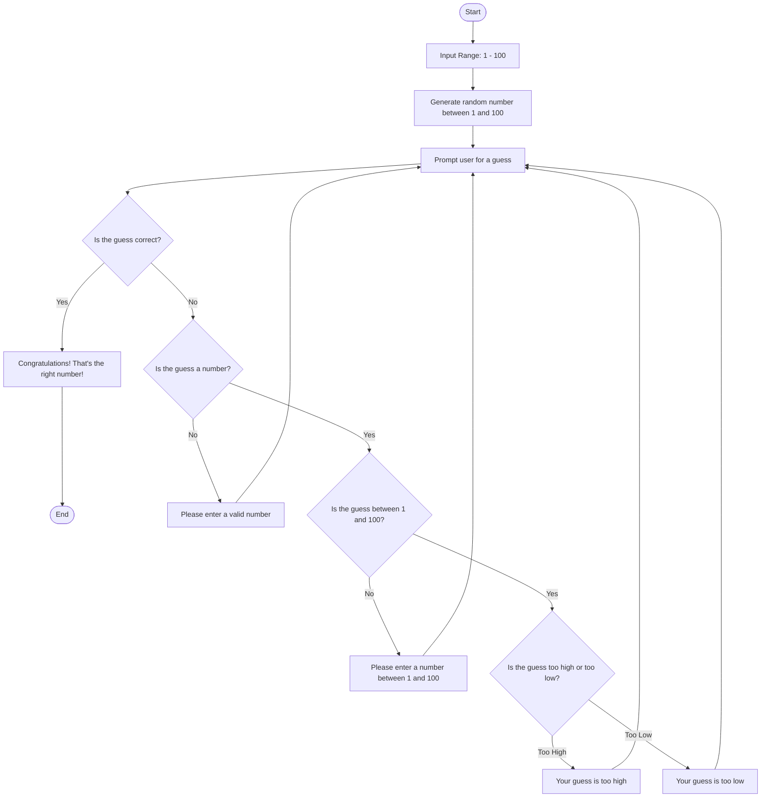

# Process Description
1. The game begins by informing you there is a number picked between 1 and 100.
2. The game then generates the number between 1 and 100.
3. The user is then prompted to guess the number.
4. The game checks if the user's guess is right or wrong
5. If the guess is right, the game displays a winning message and ends.
6. If the guess is wrong, it first checks if the input given was a number.
7. If the input was not a number, it gives a message to enter a valid number and guess again.
8. If it was a valid number, it then checks if the number was over 100 or less than 0, and if so, displays an error message, and prompts to guess again.
9. After the game knows you've guessed a number between 1-100 that's wrong, it will give you a hint that the number generated is lower or higher than the guess.
10. The game repeats until the guess is correct.
