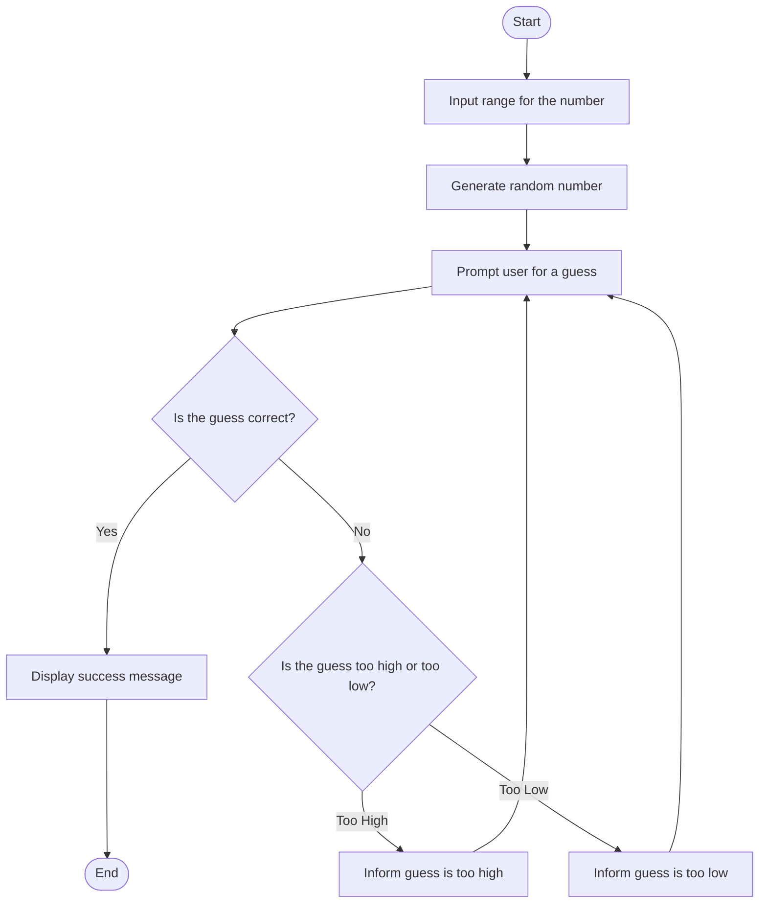

```mermaid
flowchart TD
    Start([Start]) --> InputRange["Input range for the number"]
    InputRange --> GenerateNumber["Generate random number"]
    GenerateNumber --> InputGuess["Prompt user for a guess"]
    InputGuess --> CheckGuess{"Is the guess correct?"}
    CheckGuess -->|Yes| CorrectGuess["Display success message"]
    CorrectGuess --> End([End])
    CheckGuess -->|No| CheckHighLow{"Is the guess too high or too low?"}
    CheckHighLow -->|Too High| HintHigh["Inform guess is too high"]
    HintHigh --> InputGuess
    CheckHighLow -->|Too Low| HintLow["Inform guess is too low"]
    HintLow --> InputGuess
```

# Process Description
